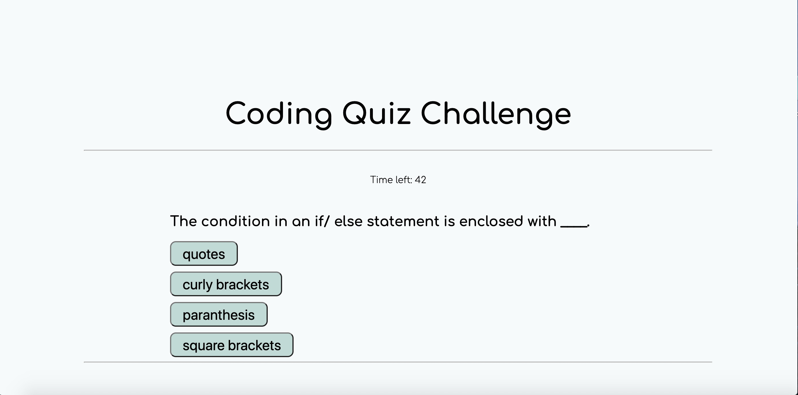

# JavaScript Coding Quiz

Goal was to build a timed coding quiz with multiple-choice questions. The app will run in the browser, and will feature dynamically updated HTML and CSS powered by Javascript code.

## Built with
* HTML
* CSS
* JavaScript

### Website preview

### Link to website
https://beccahurtado.github.io/javascript-quiz/

## Created by : Rebecca Hurtado

